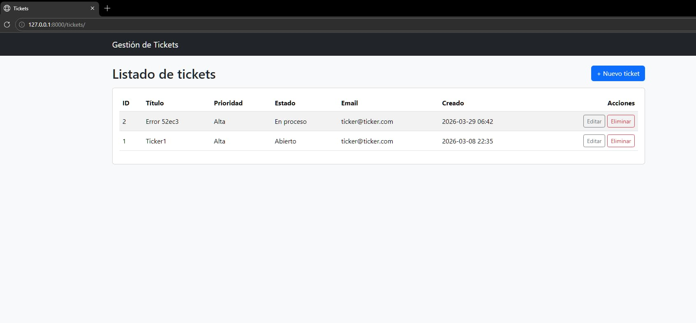

# Soporte Empresa (Django)

Mini sistema de **gestión de tickets de soporte** (CRUD) hecho con Django y Class-Based Views.

## Funcionalidad
- Listar tickets: `GET /tickets/` (y `/` redirige aquí)
- Crear ticket: `GET|POST /tickets/nuevo/`
- Editar ticket: `GET|POST /tickets/editar/<pk>/`
- Eliminar ticket (confirmación): `GET|POST /tickets/eliminar/<pk>/`

Modelo `Ticket`: `titulo`, `email_contacto`, `prioridad`, `estado`, `descripcion`, `fecha_creacion`.

## Ejecutar
```powershell
python manage.py migrate
python manage.py runserver
```
Luego abre `http://127.0.0.1:8000/`.

## Captura
Guarda la imagen como `docs/tickets.jpg` y se verá aquí:


